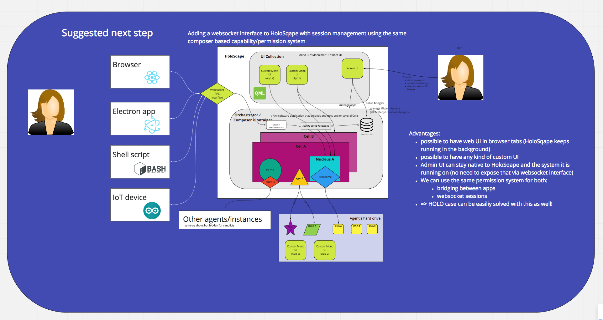

# 16. Conductor Interface for web UI clients

Date: 2018-09-14

## Status

Accepted

## Context
* We have an implementation of a Holochain conductor that can load QML based UIs: https://github.com/holochain/holosqape
* We also want to support HTML/JS/CSS based UIs
* We need to enable pure Web clients to connect to a HoloPort for the Holo use-case
* With [ADR 13](https://github.com/holochain/holochain-rust/blob/develop/doc/architecture/decisions/0013-signals-listeners-model-and-api.md)
  we defined *app signals*, i.e. events that a Holochain app can push - we need to make sure UIs can receive these as
  pushed notifications from the Holochain node

## Requirements
It seems we need the advantages of both worlds:
* having a rich context in which apps run so we can do bridging and other sophisticated
  app composability features (the need for a conductor/composer)
* we need clients that are running any kind of UI (or connecting with IoT devices)
  to be able to connect with Holochain apps easily
### Mandatory
- Any full-node Holochain instance should be online most of the time (i.e. not tied to the browser process)
  to be available to the DHT, which makes it unattractive to run the whole instance in a web browser.

### Desirable
- Bi-directional communication (pub/sub)
    From the UI client side. It should be possible to subscribe to certain events such as when a node receives new data, receives a message etc.
- Exposed through an object abstraction in the browser runtime (like web3)
- Can also be used to connect to a remote node for compatability with Holo

## Considered Solutions

### 1. Daemon conductor that accepts function calls via RESTful HTTP requests

This is the solution implemented in proto.
A single daemon conductor exposes end-points for calling functions namespaced by app and by zome.

#### Benefits

REST is simple to use and easy to understand. Every web developer knows or can
easily find a tutorial on how to interface with a REST API.

REST is interoperable. There are literally hundreds, if not thousands, of REST
libraries across all useful programming languages. It is easy to open up Postman
or Insomnia, or even cURL, and fire off some requests to see what happens.
Maintainance of Holochain specific SDKs becomes a "nice to have" rather than a
permanent gate on basic usage for each new client language/environment.

REST is stateless. It is easy to reason about the state of a connection because
there is no connection state outside the immediate data transfer needs.

REST defines clear conventions. In addition to the low-level connection details
we also have a clear set of nouns and verbs for the API. This is both from the
specification and years of conventions established in the wild.

#### Tradeoffs

Holochain state changes need to be polled by the client. No "push" updates
from the backend are possible. Polling the backend (at least in proto) can "DOS"
the local agent easily. For example, lib-p2p implements an exponential back off
when hit more than twice per second, which is easy to do if there are several
loops in the client polling various endpoints.

Secondary drawback (in the proto version) is that HTTP requests include a lot of
contextual information in headers etc. that aren't being handled at all right
now, and don't have a clear "right way" to handle in a Holochain context

### 2. Daemon conductor that exposes WebSockets for bi-directional communication

Instead of using HTTP, keep a permanent WebSocket connection between UI client
and Holochain node.

Define a protocol to use over the WebSocket so that clients can take advantage
of conductor features such as talking to multiple apps.

Make use of sessions and a permission system to only expose certain apps or
capabilities to remote UIs. WebSocket/streaming permission systems commonly work
on a "topic" basis e.g. pub/sub rather than on a resource/verb basis like REST.

#### Benefits

This seems to be needed at least for _Holo_ if not Holochain. Keeping an open
connection between client/holoport for as long as possible makes a lot of sense
for a lot of reasons (performance, routing, analytics, etc.).

WebSockets can send data with much less overhead than HTTP once a connection is
established.

Both the client and server can push data to each other ad-hoc.

Of all the options that allow the backend to push data, WebSockets scales the
best on the server. 1024 parallel connections can be opened per client, while
SSE and long poll only support ~6 parallel connections per client. Whether 6
parallel connections would be "enough" is highly speculative at this point.

Has pretty good browser support. Notably IE10+.

Because WebSockets allows the implementation of a connection lifecycle, servers
can detect and respond to a dropped connection.

#### Tradeoffs

WebSockets is low level and has relatively very little opinions/conventions
about how to represent connection state and transferred data vs. REST.

State management data and callbacks (ping/pong/close) must be implemented and
handled by each client/server pairing. Implementation of the client becomes tied
to implementation of the server. REST only defines data structures that any
server can implement, WebSockets requires _both_ data structures and lifecycle
management to line up.

Handling of dropped/lost/hanging connections is not automatic nor specified by
WebSockets. This is probably a big benefit for _Holo_ because it offers explicit
control over the connection lifecycle. This is extra work/complexity for a
"vanilla" _Holochain_ client/server setup. Care must be taken to avoid stale
WebSocket states piling up on the backend if they are not garbage collected
effectively.

There is no pull of data in WebSockets. This must be faked on a
per-implementation basis by lining up request/response data at each end. In
practise a lot of libraries offer this out of the box, but it is worth being
aware of.

WebSockets can be viewed in debug tools, e.g. in the Chrome network tab, but is
much harder to work with "by hand" than REST. Typically the only way to work
with WebSockets is through editing and running "live code" and relying on debug
output from that.

WebSockets is a relatively advanced topic for most web developers. It is no
longer the bleeding edge, nor dangerously archaic/niche, but it is also not
documented/understood to the ubiquitous level that REST is.

WebSockets breaks most commercial load balancers/CDNs and is generally complex
or impossible to setup through proxying. For _Holochain_ this should not be an
issue as the WebSocket server and client are typically on the same machine. For
_Holo_ this may be problematic depending on how the network is ultimately
configured.

Realistic usage of WebSockets binds clientside development to the usage of
Holochain specific SDKs, whether official or unofficial. If an SDK is not
available for your language/environment (e.g. Python) then you have no ability
to access the server.

### 3. Daemon conductor that exposes REST + Server Sent Events (SSE) for push communication

Works the same as REST but implements Server Sent Events for push of data the
client has subscribed to. SSE was part of HTML5, now part of the EventSource
interface/spec.

#### Benefits

Automatic reconnection handling.

Works with load balancing/CDNs.

Preserves all the benefits of a REST API for most data. SSE is used only to
notify the client that there are changes it has previously subscribed to.

#### Tradeoffs

Limited to ~6 parallel connections.

Lower browser support than WebSockets. Notably absent from all IE/edge products.
Available as a polyfill for IE10+ for roughly the same support as WebSockets.

As per WebSockets, not particularly easy to debug by hand as a heartbeat must be
provided to maintain the connection.

Automatic reconnection handling might be a bad thing for _Holo_ if said handling
doesn't align with those needs.

### 4. Daemon conductor that exposes REST + Long polling client

Long polling is a more sophisticated (or hacky, depending on your POV) approach
to a simple poll loop on the client.

In a long poll setup:

0. The client requests data
0. The server sends data if it is available or holds open the connection
  - the connection is held open until new data becomes available, then sent
  - the open connection may time out if no new data becomes available
0. The client re-opens a connection as soon as it is closed
  - due to either receiving new data or a timeout

#### Benefits

Works on all browsers as it is a simple riff on standard polling techniques.

Stateless and scalable connections. Up to 6 parallel connections client-side.
No garbage collection, memory or stale connection tracking needed server-side.

Still requires state on the server to track what is meant by "when new data
becomes available" on a per-client basis.

Easy to debug, understand and develop client-side in the same way as REST.

Clients handle their own reconnections, so no need for complex lifecycle state
management, heartbeats, etc.

Does not tie development to mandatory use of an SDK, although developers would
need to be aware that connections are left open until data is available.

Could be easily toggled on/off depending on application's needs. Clients that
only need standard REST polling do not have to long poll.

#### Tradeoffs

Clients handle their own reconnections, which may be undesirable for _Holo_.
When a client attempts to reconnect for the next item of data it must be routed
to the same _Holo_ backend somehow.

Some connection overhead relative to WebSockets. Whether this is is a real issue
depends on volume/frequency of reconnections/pushes.

### 5. Daemon conductor communicating with browser plug-in via IPC

This is similar to MetaMask for Ethereum communicating with a local node via IPC.

Plug-in exposes Holochain calls to the JavaScript running on the page via an injected object

Plug-in communicates with daemon via an IPC file or similar

#### Benefits

Not sure yet what substantial advantage this holds over other available options.

There may be other benefits, e.g. storage backends, but nothing obvious from the
perspective of data push/pull.

#### Tradeoffs

Requires end-users to install the plug-in.

Requires development of the plug-in.

Impossible to use with any client that cannot install the plug-in (e.g. python,
postman, cURL, etc.).

### 6. Holochain conductor runs a custom browser that exposes calls directly

This is comparable to the Mist browser for Ethereum and currently implemented
for QML front-ends with [HoloSqape](https://github.com/holochain/holosqape).

This could be re-done with web technology such as [Electron](https://electronjs.org/) and [Holochain-nodejs](https://github.com/holochain/holochain-nodejs).

#### Benefits

Similar to plugin but removes the need for IPC.

Brings us into the world of web-based, cross-platform native applications.

#### Tradeoffs

Would need to continue running in the background when no windows are open.

Requires development of a custom browser.

Doesn't empower client-side development outside the custom browser.

Probably better implemented as electron apps sitting on top of one of the other
client-side solutions above.

### Other Discussions

There is also the possibility to implement multiple of the above (as Ethereum has). This might be more practical where there are many more people working on core. The real problem is which to do first

## Decision

Start with: Option 2.

The existing Holochain conductor project HoloSqape is to be extended to provide a **WebSocket interface**
(next to the QML based GUI plug-in system) that enables many different kinds of external
user interfaces to connect to the local Holochain node, authenticate, issue zome calls and receive zome signals,
depending on permissions administered by the local user of the node through an admin UI or default settings.

A **JavaScript based client library** is to be implemented that makes it easy to use this interface from the context
of a web browser, hiding the complexity and wire-protocol of the websocket interface itself, only offering high-level
functionality such as:
* connecting to a local or remote node
* authentication (public-key? JWT tokens?)
* quering installed/running apps, the session has access to
* issuing zome function calls and receiving results
* registering callbacks for zome signals
* lifecycle management of the websocket connection

Followup with: Option 1 and/or 4

Providing some kind of RESTful interface to Holochain is needed if we are
serious about reaching the widest development audience across the most client
languages/environments possible.

The good news is that there are many existing examples of realtime providers and
libraries/frameworks offering both WebSockets and REST APIs (e.g. Twillio, Ably,
Feathers, Slack, etc.).

Long term: Holo server/clients and native electron apps

Woo!

## Consequences

* WebSocket interface needs to be designed (upcoming ADR) and implemented
* App developers have an alternative to QML based UIs
* Web based UIs can be build and run separately from the Holochain node itself, both locally and remotely
* Web based UIs can just be a browser tab since Holochain app keeps running in HoloSqape without it
* UI and Holochain node are connected through permanent bi-directional connection
* Push notifications can be send from the node to the external UI

## Further reading

Here is an excellent blog post summarising websockets vs. SSE vs. long poll:
https://blog.stanko.io/do-you-really-need-websockets-343aed40aa9b
